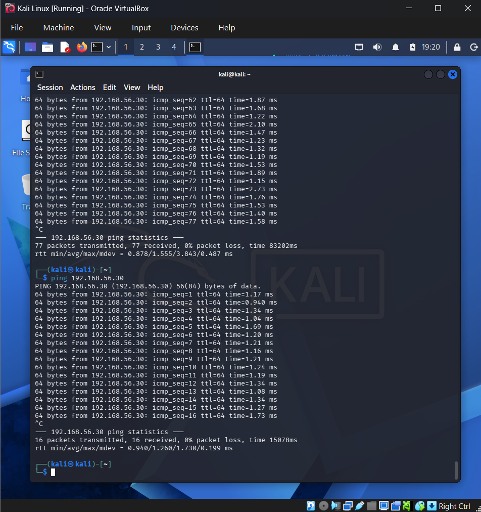
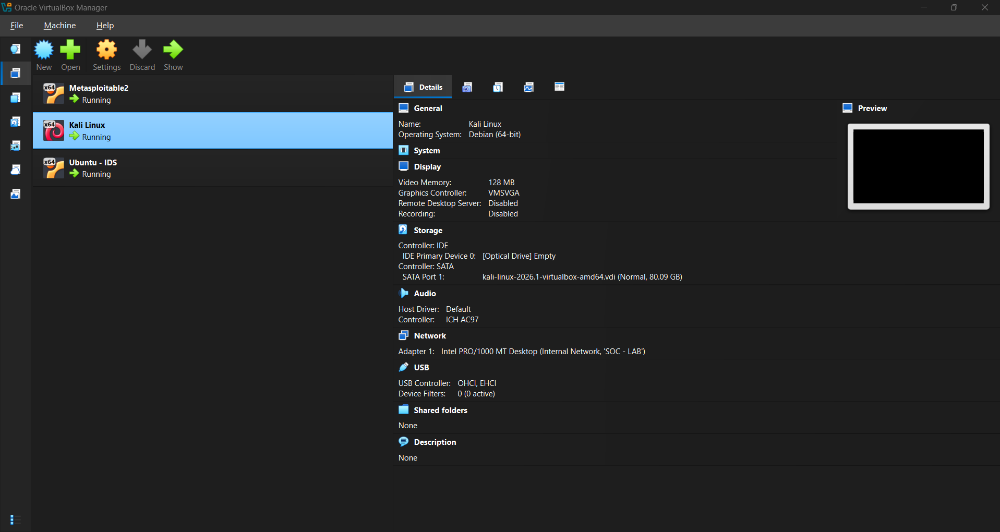
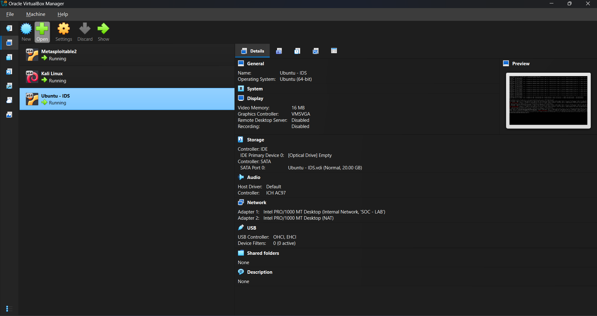
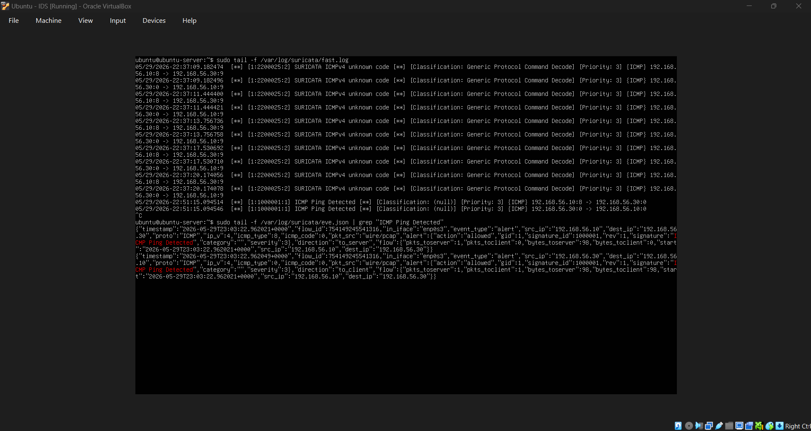
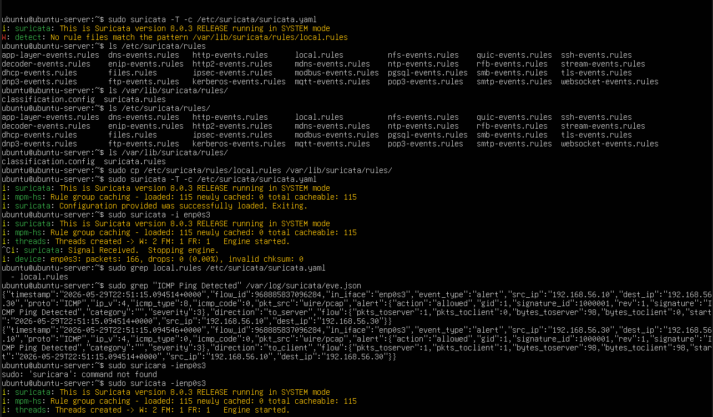

# Network Intrusion Detection Lab

## Overview

This project demonstrates a beginner-friendly Network Intrusion Detection System (IDS) lab built using Suricata inside Oracle VirtualBox.

The objective of this lab was to understand:

* Network intrusion detection concepts
* Packet monitoring and traffic visibility
* Linux networking fundamentals
* Suricata rule creation
* Attack simulation
* IDS alert generation
* Basic SOC workflows
* Network troubleshooting and detection engineering

The entire environment was isolated inside a virtual network to safely simulate attack traffic between multiple virtual machines.

---

# Lab Architecture

```text
Kali Linux (Attacker)
        |
        | 192.168.56.0/24
        |
Ubuntu Server + Suricata IDS
        |
Metasploitable2 (Target)
```

---

# Technologies Used

| Tool              | Purpose                             |
| ----------------- | ----------------------------------- |
| Oracle VirtualBox | Virtualization platform             |
| Kali Linux        | Attack simulation                   |
| Ubuntu Server     | IDS monitoring server               |
| Suricata          | Intrusion Detection System          |
| Metasploitable2   | Vulnerable target machine           |
| tcpdump           | Packet capture verification         |
| Nmap              | Network scanning and reconnaissance |

---

# Features Implemented

* Configured isolated SOC-LAB internal network
* Installed and configured Suricata IDS
* Configured static IP addressing
* Created custom ICMP detection rule
* Generated attack traffic from Kali Linux
* Verified packet visibility using tcpdump
* Monitored alerts using eve.json
* Performed Nmap reconnaissance testing
* Troubleshooted networking and IDS visibility issues
* Built real-time packet monitoring workflow

---

# Network Configuration

| Machine           | IP Address    |
| ----------------- | ------------- |
| Kali Linux        | 192.168.56.10 |
| Metasploitable2   | 192.168.56.20 |
| Ubuntu IDS Server | 192.168.56.30 |

---

# Custom Detection Rule

```rules
alert icmp any any -> any any (msg:"ICMP Ping Detected"; sid:1000001; rev:1;)
```

This custom rule generates alerts whenever ICMP ping traffic is detected by Suricata.

---

# Running Suricata

## Validate Configuration

```bash
sudo suricata -T -c /etc/suricata/suricata.yaml
```

---

## Start Suricata Engine

```bash
sudo suricata -i enp0s3
```

---

## Monitor Alerts

```bash
sudo tail -f /var/log/suricata/eve.json | grep "ICMP Ping Detected"
```

---

# Attack Simulation

## Ping Test

```bash
ping 192.168.56.30
```

---

## Nmap Aggressive Scan

```bash
nmap -A 192.168.56.30
```

---

# Screenshots

## Complete Lab Environment


---

## Kali Linux Attack Machine



---

## Kali Linux Configuration



---

## Metasploitable2 Configuration


---

## Ubuntu IDS Configuration



---

## Suricata Alert Detection



---

## Suricata Engine Running



---

# Documentation

Detailed technical documentation is available inside the `docs/` directory.

| File                                    | Description                                          |
| --------------------------------------- | ---------------------------------------------------- |
| `installation-and-setup-guide.md`       | Full installation and environment setup guide        |
| `commands-and-technical-explanation.md` | Linux, networking, and Suricata command explanations |
| `challenges-and-solutions.md`           | Troubleshooting process and lessons learned          |

---

# Repository Structure

```text
network-intrusion-detection-lab/
│
├── README.md
│
├── docs/
│   ├── installation-and-setup-guide.md
│   ├── commands-and-technical-explanation.md
│   └── challenges-and-solutions.md
│
├── rules/
│   └── local.rules
│
└── screenshots/
```

---

# Key Lessons Learned

* IDS visibility depends heavily on network architecture
* Packet capture does not automatically generate alerts
* Suricata mainly logs structured events into eve.json
* Linux interface selection directly affects packet visibility
* Internal Network and NAT serve different networking purposes
* Packet visibility, rule loading, and alert generation are separate IDS stages
* Troubleshooting methodology is critical in cybersecurity engineering

---

# Future Improvements

Planned future enhancements:

* Wazuh SIEM integration
* Elasticsearch and Kibana dashboards
* Zeek network monitoring
* Additional Suricata detection rules
* Brute-force attack detection
* DNS and HTTP traffic analysis
* Centralized log management
* Detection engineering improvements

---

# Disclaimer

This project was created strictly for:

* educational purposes
* cybersecurity learning
* IDS experimentation

All testing was performed inside an isolated virtual lab environment.
